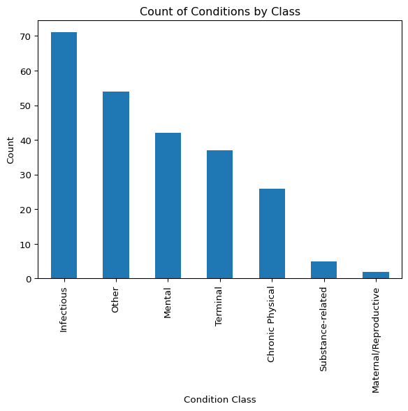

# Unstructured Final Project: WHO Health Conditions


# WHO Health Conditions: A Text Analysis of Key Facts and Consequences

For this analysis, I wanted to understand patterns in the tones of
reporting various heath conditions. The World Health Organization (WHO)
provides a comprehensive list of health conditions alphabetical order on
their website, and each condition is linked to a fact sheet that
contains a variety of information ranging from key facts, to prevention,
to consequences. I scraped the WHO website to extract the key facts and
consequences for each condition, and then analyzed the text to identify
common themes and patterns.

When investigating the page structure, the newroom factsheet displays an
alphabetical list of conditions with each condition linking to a
seperate page with more information. These pages do not contain the same
sections, but most contain a “Key facts” section and a few have a
“Consequence” section. This first section of code focuses on using
BeautifulSoup to extract condition names and their urls which follow the
pattern “https://www.who.int/news-room/fact-sheets/detail/condition”.
The length of the collected dataframe reflects there are 237 total
conditions listed on the WHO website.

``` python
import requests
from bs4 import BeautifulSoup
import pandas as pd
import re

factsheets = "https://www.who.int/news-room/fact-sheets"
response = requests.get(factsheets)
soup = BeautifulSoup(response.text, "html.parser")

condition_names = []
condition_hrefs = []

for i in soup.find_all("a", href=True):
    href = i["href"]
    if "/news-room/fact-sheets/detail/" in href:
        name = i.get_text(strip=True)
        condition_names.append(name) 
        condition_hrefs.append("https://www.who.int" + href)  

df = pd.DataFrame({
    "condition": condition_names,
    "url": condition_hrefs})

print(df.head(20))
print("Total conditions:", len(df))
```

                                condition  \
    0                            Abortion   
    1               Abuse of older people   
    2   Adolescent and young adult health   
    3                Adolescent pregnancy   
    4                   Ageing and health   
    5                             Alcohol   
    6     Ambient (outdoor) air pollution   
    7                             Anaemia   
    8                        Animal bites   
    9            Antimicrobial resistance   
    10                  Anxiety disorders   
    11                            Arsenic   
    12                           Asbestos   
    13               Assistive technology   
    14                             Asthma   
    15                             Autism   
    16                Bacterial vaginosis   
    17                       Biodiversity   
    18                   Bipolar disorder   
    19    Blindness and vision impairment   

                                                      url  
    0   https://www.who.int/news-room/fact-sheets/deta...  
    1   https://www.who.int/news-room/fact-sheets/deta...  
    2   https://www.who.int/news-room/fact-sheets/deta...  
    3   https://www.who.int/news-room/fact-sheets/deta...  
    4   https://www.who.int/news-room/fact-sheets/deta...  
    5   https://www.who.int/news-room/fact-sheets/deta...  
    6   https://www.who.int/news-room/fact-sheets/deta...  
    7   https://www.who.int/news-room/fact-sheets/deta...  
    8   https://www.who.int/news-room/fact-sheets/deta...  
    9   https://www.who.int/news-room/fact-sheets/deta...  
    10  https://www.who.int/news-room/fact-sheets/deta...  
    11  https://www.who.int/news-room/fact-sheets/deta...  
    12  https://www.who.int/news-room/fact-sheets/deta...  
    13  https://www.who.int/news-room/fact-sheets/deta...  
    14  https://www.who.int/news-room/fact-sheets/deta...  
    15  https://www.who.int/news-room/fact-sheets/deta...  
    16  https://www.who.int/news-room/fact-sheets/deta...  
    17  https://www.who.int/news-room/fact-sheets/deta...  
    18  https://www.who.int/news-room/fact-sheets/deta...  
    19  https://www.who.int/news-room/fact-sheets/deta...  
    Total conditions: 237

I then iterated through each condition page and used BeautifulSoup to
extract the text from the “Key facts” and “Consequence” sections. I
search through the section headers to identify where the sections start.
When it finds the key facts header it finds the bullet points in the
section and joins them together into a single string with a separator.
For consequences, I catpure all of the text until the next header. I
also added a time.sleep(0.5) to avoid overwhelming the server with
requests.

``` python
import time
final_df = []

for i in range(len(df)):
    url = df.loc[i, 'url']
    condition_name = df.loc[i, 'condition']
    
    try:
        response = requests.get(url)
        soup = BeautifulSoup(response.text, "html.parser")
        
        key_facts_text = ""
        consequences_text = ""

        for header in soup.find_all(["h2", "h3"]):
            header_text = header.get_text(strip=True).lower()
            
            # key fact section
            if "key facts" in header_text:
                ul = header.find_next("ul")
                if ul:
                    key_facts_text = " | ".join([li.get_text(strip=True) for li in ul.find_all("li")])
            
            # consequence section
            if "consequence" in header_text:  
               
                content = ""
                next_elem = header.find_next_sibling()
   
                while next_elem and next_elem.name not in ["h2", "h3"]:
                    content += " " + next_elem.get_text(strip=True)
                    next_elem = next_elem.find_next_sibling()
                consequences_text = content.strip()
        


        final_df.append({
            "condition": condition_name,
            "url": url,
            "key_facts": key_facts_text,
            "consequences": consequences_text
        })
        time.sleep(0.5)
        
    except Exception as e:
        print(f"Error {url}: {e}")
```

``` python
condition_df = pd.DataFrame(final_df)
print(condition_df.head())
```

                               condition  \
    0                           Abortion   
    1              Abuse of older people   
    2  Adolescent and young adult health   
    3               Adolescent pregnancy   
    4                  Ageing and health   

                                                     url  \
    0  https://www.who.int/news-room/fact-sheets/deta...   
    1  https://www.who.int/news-room/fact-sheets/deta...   
    2  https://www.who.int/news-room/fact-sheets/deta...   
    3  https://www.who.int/news-room/fact-sheets/deta...   
    4  https://www.who.int/news-room/fact-sheets/deta...   

                                               key_facts  \
    0  Six out of 10 unintended pregnancies end in in...   
    1  Around 1 in 6 people 60 years and older experi...   
    2  Over 1.5 million adolescents and young adults ...   
    3  As of 2019, adolescents aged 15–19 years in lo...   
    4  All countries face major challenges to ensure ...   

                                            consequences  
    0  Lack of access to safe, affordable, timely and...  
    1  Abuse of older people can have serious physica...  
    2                                                     
    3                                                     
    4                                                     

``` python
import numpy as np

condition_df["consequences"] = (condition_df["consequences"].replace("", np.nan).replace(r"^\s*$", np.nan, regex=True))

num_consequences = condition_df["consequences"].notna().sum()
print(num_consequences)
num_key_facts = condition_df["key_facts"].notna().sum()
print(num_key_facts)
print(len(condition_df))
condition_df = condition_df[condition_df["key_facts"].notna()]
```

    7
    237
    237

Taking a look at what was scraped, it seems that there are only 7
conditions that have consequences listed and 237 conditions that have
key facts listed. Since the key facts section is more common, I will be
using this section for the topic modeling portion of the analysis.

# Sentiment Analysis

## Objective: What is the typical tone of key facts? For the conditions that have consequences, how does the tone of the consequences compare to the tone of the key facts? Are there conditions where these tones differ significantly?

``` python
from transformers import pipeline
sentiment_analysis = pipeline("sentiment-analysis")
```

    No model was supplied, defaulted to distilbert/distilbert-base-uncased-finetuned-sst-2-english and revision 714eb0f.
    Using a pipeline without specifying a model name and revision in production is not recommended.

    Loading weights:   0%|          | 0/104 [00:00<?, ?it/s]

## Labels and Scores for Key Facts

First things first, I got the scores and labels for key facts and
consequences. Since there are only 4 conditions with consequences, most
will be recorded as None. I also limited the text to the first 500
characters.

``` python
key_facts_labels = []
key_facts_scores = []
for text in condition_df["key_facts"]:
    if pd.isna(text):
        key_facts_labels.append(None)
        key_facts_scores.append(None)
    else:
        result = sentiment_analysis(text[:500])
    key_facts_labels.append(result[0]["label"])
    key_facts_scores.append(result[0]["score"])
```

## Labels and Scores for Consequences

``` python
consequence_labels = []
consequence_scores = []

for text in condition_df["consequences"]:
    if pd.isna(text):
        consequence_labels.append(None)
        consequence_scores.append(None)
    else:
        result = sentiment_analysis(text[:500])
        consequence_labels.append(result[0]["label"])
        consequence_scores.append(result[0]["score"])
```

``` python
condition_df["key_facts_sentiment"] = key_facts_labels
condition_df["key_facts_confidence"] = key_facts_scores
condition_df["consequences_sentiment"] = consequence_labels
condition_df["consequences_confidence"] = consequence_scores
```

Next, I wanted to compare the conditions that have consequences to their
key facts to see if there are any noticable differences in tone. I
filtered out the conditions that do not have consequences and then
compared the sentiment labels and confidence scores for the key facts
and consequences. I also calculated the average confidence score for
both key facts and consequences to see if there is a general trend in
tone across all conditions.

``` python
comparison = condition_df[condition_df["consequences"].notna()]
comparison[["condition", "key_facts_sentiment", "key_facts_confidence", "consequences_sentiment", "consequences_confidence"]]
```

<div>
<style scoped>
    .dataframe tbody tr th:only-of-type {
        vertical-align: middle;
    }
&#10;    .dataframe tbody tr th {
        vertical-align: top;
    }
&#10;    .dataframe thead th {
        text-align: right;
    }
</style>

|  | condition | key_facts_sentiment | key_facts_confidence | consequences_sentiment | consequences_confidence |
|----|----|----|----|----|----|
| 0 | Abortion | NEGATIVE | 0.918121 | NEGATIVE | 0.990474 |
| 1 | Abuse of older people | NEGATIVE | 0.991790 | NEGATIVE | 0.978549 |
| 8 | Animal bites | NEGATIVE | 0.972426 | POSITIVE | 0.963824 |
| 33 | Child maltreatment | NEGATIVE | 0.998590 | NEGATIVE | 0.996446 |
| 48 | Corporal punishment of children and health | NEGATIVE | 0.995681 | NEGATIVE | 0.985425 |
| 151 | Obesity and overweight | NEGATIVE | 0.970929 | POSITIVE | 0.950793 |
| 229 | Violence against women | NEGATIVE | 0.994274 | NEGATIVE | 0.981998 |

</div>

Since there are only 7 conditions that recorded consequences it is easy
to visually compare the sentiment labels for key facts and consequences.
Almost all of them were recorded to have a negative tone however two
rows stand out. The consequence sentiment for animal bites and obesity
and overweight were both labeled as positive while their key facts are
labeled as negative. I would have expected if anything for the
consequences to be more negative than the key facts, so this is an
interesting finding.

I wanted to take a closer look at the conditions that were identified as
having a positive tone in the key facts section to see if there were any
common themes or patterns in the language used. I filtered the dataframe
to only include conditions with a positive sentiment label for key facts
and then examined the full text using
pd.set_option(“display.max_colwidth”, None) to ensure that the entire
text was visible.

``` python
positives = condition_df[condition_df["key_facts_sentiment"] == "POSITIVE"]

pd.set_option("display.max_colwidth", None)
positives[["condition", "key_facts","key_facts_sentiment", "key_facts_confidence"]].head(4)
```

<div>
<style scoped>
    .dataframe tbody tr th:only-of-type {
        vertical-align: middle;
    }
&#10;    .dataframe tbody tr th {
        vertical-align: top;
    }
&#10;    .dataframe thead th {
        text-align: right;
    }
</style>

|  | condition | key_facts | key_facts_sentiment | key_facts_confidence |
|----|----|----|----|----|
| 4 | Ageing and health | All countries face major challenges to ensure that their health and social systems are ready to make the most of this demographic shift. \| In 2050, 80% of older people will be living in low- and middle-income countries. \| The pace of population ageing is much faster than in the past. \| In 2020, the number of people aged 60 years and older outnumbered children younger than 5 years. \| Between 2015 and 2050, the proportion of the world's population over 60 years will nearly double from 12% to 22%. | POSITIVE | 0.892828 |
| 10 | Anxiety disorders | Anxiety disorders are the world’s most common mental disorders, affecting 359 million people in 2021. \| More women are affected by anxiety disorders than men. \| Symptoms of anxiety often have onset during childhood or adolescence. \| There are highly effective treatments for anxiety disorders. \| Approximately 1 in 4 people with anxiety disorders receive treatment for this condition. | POSITIVE | 0.919064 |
| 13 | Assistive technology | Assistive products can range from physical products such as wheelchairs, glasses, prosthetic limbs, white canes, and hearing aids to digital solutions such as speech recognition or time management software and captioning. \| Most people who use assistive technology use more than one product, making integrated services important. \| Globally, more than 2.5 billion people need one or more assistive products. \| With an ageing global population and a rise in noncommunicable diseases, an estimated 3.5 billion people will need assistive technology by 2050. \| In many countries, most people who need assistive technology do not have access to it. | POSITIVE | 0.968308 |
| 31 | Chagas disease (also known as American trypanosomiasis) |  | POSITIVE | 0.748121 |

</div>

Taking a closer look at the first condition it flagged as positive,
“Ageing and health”, it seems the model classified this passage as
positive because it is reacting to the tone of the language rather than
the broader demographic implications. Phrases such as “make the most of
this demographic shift” and words like “ensure” and “living” are
commonly associated with proactive, constructive, or optimistic contexts
in the data the model was trained on. Even “older people” is a neutral
demographic descriptor, not an emotionally negative phrase. Although the
passage describes serious structural challenges related to population
ageing, it does so using formal, policy-oriented language rather than
emotionally charged or negative wording. Transformer-based sentiment
analysis models can sometimes misclassify text that is discussing
serious or negative topics if the language used is more neutral or
formal, as they rely heavily on the presence of certain words and
phrases to determine sentiment. In this case, the model may have picked
up on the more neutral or even slightly optimistic language used in the
passage, leading it to classify it as positive despite the underlying
topic being about challenges related to ageing.

## Final Summary of Sentiment Analysis

``` python
print("Avg confidence score key facts:", condition_df["key_facts_confidence"].mean())
print("Avg confidence score consequences:", condition_df["consequences_confidence"].mean()) 
print("Positive key facts:", (condition_df["key_facts_sentiment"] == "POSITIVE").sum())
print("Negative key facts:", (condition_df["key_facts_sentiment"] == "NEGATIVE").sum())
```

    Avg confidence score key facts: 0.946993225737463
    Avg confidence score consequences: 0.9782155667032514
    Positive key facts: 49
    Negative key facts: 188

I think the most interesting thing about the results of this analysis
are the immensely high confidence scores for both key facts and
consequences. With the average confidence score being above 0.9 for key
facts, this means that it was very confident for all 237 conditions it
analyzed. Further, it did find a decent number of conditions to have
positive key facts, which is interesting given the nature of the
content. These results highlight some of the limitations in using
sentiment analysis models for analyzing complex and nuanced text,
especially in the context of health conditions where the language may be
more formal and less emotional. The model’s reliance on certain words
and phrases to determine sentiment can lead to misclassifications, as
seen in the case of “Ageing and health”. This underscores the importance
of critically evaluating the results of sentiment analysis and
considering the broader context of the text being analyzed.

# Classification and Topic Modeling

The first task was to break conditions into different categories based
on type of condition. I had ChatGPT generate a list of 9 categories and
keywords for each category. As much as I love this topic, I am not well
versed in the vocabulary in the world of health.

``` python
classes = [
    "Mental",
    "Chronic Physical",
    "Acute Physical",
    "Terminal",
    "Infectious",
    "Environmental",
    "Maternal/Reproductive",
    "Substance-related",
    "Other"
]
```

``` python
category_keywords = {
    "Mental": [
        "depression", "anxiety", "mental", "suicide",
        "psychological", "psychiatric", "bipolar", "schizophrenia"
    ],
    
    "Chronic Physical": [
        "chronic", "diabetes", "cardiovascular",
        "hypertension", "asthma", "arthritis"
    ],
    
    "Infectious": [
        "virus", "bacterial", "infection", "infectious",
        "tuberculosis", "malaria", "hiv"
    ],
    
    "Terminal": [
        "terminal", "fatal", "mortality", "death",
        "end-stage", "life-threatening"
    ],
    
    "Substance-related": [
        "alcohol", "drug", "substance", "addiction",
        "tobacco"
    ],
    
    "Maternal/Reproductive": [
        "pregnancy", "maternal", "birth", "reproductive",
        "infant"
    ]
}
```

Using these keywords, I created a function to classify conditions into
the categories. If a condition did not contain any of the keywords, it
was classified as “Other”. I then applied this function to the key facts
column to create a new column in the dataframe with the condition class.

``` python
def classify_condition(text):
    if pd.isna(text):
        return "Other"
    
    text = str(text).lower()
    
    for category, keywords in category_keywords.items():
        if any(keyword in text for keyword in keywords):
            return category
    
    return "Other"
```

``` python
condition_df["condition_class"] = condition_df["key_facts"].apply(classify_condition)
condition_df["condition_class"].value_counts()
```

    condition_class
    Infectious               71
    Other                    54
    Mental                   42
    Terminal                 37
    Chronic Physical         26
    Substance-related         5
    Maternal/Reproductive     2
    Name: count, dtype: int64

## Visualising the Breakdown

``` python
import matplotlib.pyplot as plt
condition_df["condition_class"].value_counts().plot(kind="bar")
plt.title("Count of Conditions by Class")
plt.xlabel("Condition Class")
plt.ylabel("Count")
plt.show()
```



All things considered, the categories seem to have done a decent job
capturing the types of conditions available in this dataset. The “Other”
category is still high so after running the first topic model this will
likely shead light on how the conditions could be broken down further.

# Cleaning and Prep LDA

``` python
condition_df['key_facts_cleaned'] = condition_df['key_facts'].astype('str')

condition_df['key_facts_cleaned'] = condition_df['key_facts_cleaned'].str.replace('([a-z])([A-Z])', '\\1 \\2', regex=True)

condition_df['key_facts_cleaned'] = condition_df['key_facts_cleaned'].str.replace('\\[.*?\\]', ' ', regex=True)
```

``` python
from bertopic.vectorizers import ClassTfidfTransformer
from joblib import load, dump
import pandas as pd
import gensim
from gensim.models.coherencemodel import CoherenceModel
import nltk
import pandas as pd
import pprint as pprint
import spacy
```

``` python
stop_words = nltk.corpus.stopwords.words('english')

def sent_to_words(sentences):
   for sentence in sentences:
       yield(gensim.utils.simple_preprocess(str(sentence), deacc=True))


data_words = list(sent_to_words(condition_df['key_facts_cleaned']))


def remove_stopwords(texts):
   return [
       [word for word in gensim.utils.simple_preprocess(str(doc))
        if word not in stop_words]
       for doc in texts
   ]
```

``` python
bigram = gensim.models.Phrases(
 data_words, min_count=5, threshold=100
)


trigram = gensim.models.Phrases(
 bigram[data_words], threshold=100
)


bigram_mod = gensim.models.phrases.Phraser(bigram)
trigram_mod = gensim.models.phrases.Phraser(trigram)


nlp = spacy.load('en_core_web_sm')


def lemmatization(texts, allowed_postags=['NOUN', 'ADJ', 'VERB', 'ADV']):
   texts_out = []
   for sent in texts:
       doc = nlp(" ".join(sent))
       texts_out.append([
           token.lemma_ for token in doc
           if token.pos_ in allowed_postags
       ])
   return texts_out


data_words_nostops = remove_stopwords(data_words)
```

``` python
data_words_bigrams = [bigram_mod[doc] for doc in data_words_nostops]
```

``` python
data_lemmatized = lemmatization(data_words_bigrams, allowed_postags=['NOUN', 'ADJ', 'VERB', 'ADV'])


id2word = gensim.corpora.Dictionary(data_lemmatized)


texts = data_lemmatized


dump(
 [id2word, texts, data_lemmatized],
 '/Users/maddypitman/Documents/Unstructured/lda_data.joblib'
)
```

    ['/Users/maddypitman/Documents/Unstructured/lda_data.joblib']

``` python
id2word, texts, data_lemmatized = load(
 '/Users/maddypitman/Documents/Unstructured/lda_data.joblib'
)
corpus = [id2word.doc2bow(text) for text in texts]
```

``` python
lda_model = gensim.models.ldamodel.LdaModel(
 corpus=corpus,
 id2word=id2word,
 num_topics=5,
 random_state=100,
 update_every=1,
 chunksize=100,
 passes=10,
 alpha='auto',
 per_word_topics=True
)


dump(
 [lda_model, corpus],
'/Users/maddypitman/Documents/Unstructured/lda_data.joblib'
)
```

    ['/Users/maddypitman/Documents/Unstructured/lda_data.joblib']

``` python
lda_model, corpus = load(
 '/Users/maddypitman/Documents/Unstructured/lda_data.joblib'
)
pprint.pprint(lda_model.print_topics())
doc_lda = lda_model[corpus]
```

    [(0,
      '0.023*"child" + 0.021*"cause" + 0.021*"death" + 0.019*"infection" + '
      '0.019*"year" + 0.017*"disease" + 0.014*"case" + 0.010*"vaccine" + '
      '0.010*"occur" + 0.010*"people"'),
     (1,
      '0.020*"woman" + 0.015*"year" + 0.013*"cancer" + 0.012*"cause" + '
      '0.011*"risk" + 0.011*"violence" + 0.010*"health" + 0.010*"case" + '
      '0.009*"estimate" + 0.009*"infection"'),
     (2,
      '0.028*"people" + 0.028*"health" + 0.019*"year" + 0.014*"care" + '
      '0.014*"country" + 0.011*"life" + 0.011*"estimate" + 0.010*"live" + '
      '0.010*"low" + 0.008*"age"'),
     (3,
      '0.019*"disease" + 0.014*"health" + 0.014*"cause" + 0.012*"people" + '
      '0.011*"infection" + 0.010*"human" + 0.009*"include" + 0.008*"food" + '
      '0.008*"area" + 0.007*"risk"'),
     (4,
      '0.020*"human" + 0.015*"cause" + 0.014*"people" + 0.012*"bite" + '
      '0.011*"symptom" + 0.010*"virus" + 0.009*"animal" + 0.009*"infect" + '
      '0.009*"shingle" + 0.008*"zika"')]

The LDA topic model identified five broad themes across the WHO key
facts text. Several of the topics centered on infectious disease burden,
particularly among children, with frequent references to death,
infection, vaccines, and cases. Another theme focused on women’s health
and gender-related issues, including cancer, violence, and maternal
health indicators. A broader population topic also emerged, emphasizing
health systems, life expectancy, access to care, and differences across
countries. Together, these themes suggest that WHO reporting frequently
frames conditions in terms of mortality, demographic impact, and global
health infrastructure.

Overall, the model indicates that infectious diseases and population
health metrics are dominant patterns in the language of the fact sheets.
While some topics capture more specific clusters, such as illness types,
there is substantial overlap in high-frequency terms like death, cause,
and people. This reflects the consistent style of WHO reporting, where
conditions are often described in terms of global burden and risk
factors.

# BERTopic

``` python
from bertopic import BERTopic
```

``` python
ctfidf_model = ClassTfidfTransformer(
  reduce_frequent_words=True
)
```

``` python
topic_model = BERTopic(ctfidf_model=ctfidf_model)

topics, probs = topic_model.fit_transform(condition_df['key_facts_cleaned'].to_list())

dump(
  [topic_model, topics, probs], 
  '/Users/maddypitman/Documents/Unstructured/topic_model.joblib'
)
```

    Warning: You are sending unauthenticated requests to the HF Hub. Please set a HF_TOKEN to enable higher rate limits and faster downloads.

    Loading weights:   0%|          | 0/103 [00:00<?, ?it/s]

    BertModel LOAD REPORT from: sentence-transformers/all-MiniLM-L6-v2
    Key                     | Status     |  | 
    ------------------------+------------+--+-
    embeddings.position_ids | UNEXPECTED |  | 

    Notes:
    - UNEXPECTED    :can be ignored when loading from different task/architecture; not ok if you expect identical arch.

    ['/Users/maddypitman/Documents/Unstructured/topic_model.joblib']

``` python
topic_model, topics, probs = load(
  '/Users/maddypitman/Documents/Unstructured/topic_model.joblib'
)

topic_model.get_topic_info()

topic_model.get_topic(0)

topic_model.get_document_info(condition_df['key_facts_cleaned'].to_list())

topic_model.get_representative_docs(0)

topic_model.generate_topic_labels()

topic_model.reduce_topics(condition_df['key_facts_cleaned'].to_list(), nr_topics=10)
```

    <bertopic._bertopic.BERTopic at 0x38959c290>

``` python
docs = condition_df['key_facts_cleaned'].to_list()
targets = condition_df['condition_class'].to_list()

topics_per_class = topic_model.topics_per_class(docs, classes=targets)
```

``` python
topic_model.visualize_topics_per_class(topics_per_class, top_n_topics=10)
```

        <script type="text/javascript">
        window.PlotlyConfig = {MathJaxConfig: 'local'};
        if (window.MathJax && window.MathJax.Hub && window.MathJax.Hub.Config) {window.MathJax.Hub.Config({SVG: {font: "STIX-Web"}});}
        </script>
        <script type="module">import "https://cdn.plot.ly/plotly-3.3.1.min"</script>
        

<div>            <script src="https://cdnjs.cloudflare.com/ajax/libs/mathjax/2.7.5/MathJax.js?config=TeX-AMS-MML_SVG"></script><script type="text/javascript">if (window.MathJax && window.MathJax.Hub && window.MathJax.Hub.Config) {window.MathJax.Hub.Config({SVG: {font: "STIX-Web"}});}</script>                <script type="text/javascript">window.PlotlyConfig = {MathJaxConfig: 'local'};</script>
        <script charset="utf-8" src="https://cdn.plot.ly/plotly-3.3.1.min.js" integrity="sha256-4rD3fugVb/nVJYUv5Ky3v+fYXoouHaBSP20WIJuEiWg=" crossorigin="anonymous"></script>                <div id="836253a8-a146-41c8-ab98-d37e76d772f6" class="plotly-graph-div" style="height:900px; width:1250px;"></div>            <script type="text/javascript">                window.PLOTLYENV=window.PLOTLYENV || {};                                if (document.getElementById("836253a8-a146-41c8-ab98-d37e76d772f6")) {                    Plotly.newPlot(                        "836253a8-a146-41c8-ab98-d37e76d772f6",                        [{"hoverinfo":"text","hovertext":["\u003cb\u003eTopic 0\u003c\u002fb\u003e\u003cbr\u003eWords: of, and, the, in, to","\u003cb\u003eTopic 0\u003c\u002fb\u003e\u003cbr\u003eWords: and, in, the, of, is","\u003cb\u003eTopic 0\u003c\u002fb\u003e\u003cbr\u003eWords: and, of, the, in, to","\u003cb\u003eTopic 0\u003c\u002fb\u003e\u003cbr\u003eWords: infertility, electricity, facilities, fertility, access","\u003cb\u003eTopic 0\u003c\u002fb\u003e\u003cbr\u003eWords: and, of, the, in, to","\u003cb\u003eTopic 0\u003c\u002fb\u003e\u003cbr\u003eWords: additives, food, echinococcosis, ewaste, the","\u003cb\u003eTopic 0\u003c\u002fb\u003e\u003cbr\u003eWords: and, of, the, in, is"],"marker":{"color":"#E69F00"},"name":"0_and_of_the_in","orientation":"h","visible":true,"x":{"dtype":"i1","bdata":"JBolAioFRw=="},"y":["Other","Chronic Physical","Terminal","Maternal\u002fReproductive","Mental","Substance-related","Infectious"],"type":"bar"},{"hoverinfo":"text","hovertext":["\u003cb\u003eTopic 1\u003c\u002fb\u003e\u003cbr\u003eWords: , , , , "],"marker":{"color":"#56B4E9"},"name":"1____","orientation":"h","visible":"legendonly","x":{"dtype":"i1","bdata":"Eg=="},"y":["Other"],"type":"bar"}],                        {"template":{"data":{"barpolar":[{"marker":{"line":{"color":"white","width":0.5},"pattern":{"fillmode":"overlay","size":10,"solidity":0.2}},"type":"barpolar"}],"bar":[{"error_x":{"color":"rgb(36,36,36)"},"error_y":{"color":"rgb(36,36,36)"},"marker":{"line":{"color":"white","width":0.5},"pattern":{"fillmode":"overlay","size":10,"solidity":0.2}},"type":"bar"}],"carpet":[{"aaxis":{"endlinecolor":"rgb(36,36,36)","gridcolor":"white","linecolor":"white","minorgridcolor":"white","startlinecolor":"rgb(36,36,36)"},"baxis":{"endlinecolor":"rgb(36,36,36)","gridcolor":"white","linecolor":"white","minorgridcolor":"white","startlinecolor":"rgb(36,36,36)"},"type":"carpet"}],"choropleth":[{"colorbar":{"outlinewidth":1,"tickcolor":"rgb(36,36,36)","ticks":"outside"},"type":"choropleth"}],"contourcarpet":[{"colorbar":{"outlinewidth":1,"tickcolor":"rgb(36,36,36)","ticks":"outside"},"type":"contourcarpet"}],"contour":[{"colorbar":{"outlinewidth":1,"tickcolor":"rgb(36,36,36)","ticks":"outside"},"colorscale":[[0.0,"#440154"],[0.1111111111111111,"#482878"],[0.2222222222222222,"#3e4989"],[0.3333333333333333,"#31688e"],[0.4444444444444444,"#26828e"],[0.5555555555555556,"#1f9e89"],[0.6666666666666666,"#35b779"],[0.7777777777777778,"#6ece58"],[0.8888888888888888,"#b5de2b"],[1.0,"#fde725"]],"type":"contour"}],"heatmap":[{"colorbar":{"outlinewidth":1,"tickcolor":"rgb(36,36,36)","ticks":"outside"},"colorscale":[[0.0,"#440154"],[0.1111111111111111,"#482878"],[0.2222222222222222,"#3e4989"],[0.3333333333333333,"#31688e"],[0.4444444444444444,"#26828e"],[0.5555555555555556,"#1f9e89"],[0.6666666666666666,"#35b779"],[0.7777777777777778,"#6ece58"],[0.8888888888888888,"#b5de2b"],[1.0,"#fde725"]],"type":"heatmap"}],"histogram2dcontour":[{"colorbar":{"outlinewidth":1,"tickcolor":"rgb(36,36,36)","ticks":"outside"},"colorscale":[[0.0,"#440154"],[0.1111111111111111,"#482878"],[0.2222222222222222,"#3e4989"],[0.3333333333333333,"#31688e"],[0.4444444444444444,"#26828e"],[0.5555555555555556,"#1f9e89"],[0.6666666666666666,"#35b779"],[0.7777777777777778,"#6ece58"],[0.8888888888888888,"#b5de2b"],[1.0,"#fde725"]],"type":"histogram2dcontour"}],"histogram2d":[{"colorbar":{"outlinewidth":1,"tickcolor":"rgb(36,36,36)","ticks":"outside"},"colorscale":[[0.0,"#440154"],[0.1111111111111111,"#482878"],[0.2222222222222222,"#3e4989"],[0.3333333333333333,"#31688e"],[0.4444444444444444,"#26828e"],[0.5555555555555556,"#1f9e89"],[0.6666666666666666,"#35b779"],[0.7777777777777778,"#6ece58"],[0.8888888888888888,"#b5de2b"],[1.0,"#fde725"]],"type":"histogram2d"}],"histogram":[{"marker":{"line":{"color":"white","width":0.6}},"type":"histogram"}],"mesh3d":[{"colorbar":{"outlinewidth":1,"tickcolor":"rgb(36,36,36)","ticks":"outside"},"type":"mesh3d"}],"parcoords":[{"line":{"colorbar":{"outlinewidth":1,"tickcolor":"rgb(36,36,36)","ticks":"outside"}},"type":"parcoords"}],"pie":[{"automargin":true,"type":"pie"}],"scatter3d":[{"line":{"colorbar":{"outlinewidth":1,"tickcolor":"rgb(36,36,36)","ticks":"outside"}},"marker":{"colorbar":{"outlinewidth":1,"tickcolor":"rgb(36,36,36)","ticks":"outside"}},"type":"scatter3d"}],"scattercarpet":[{"marker":{"colorbar":{"outlinewidth":1,"tickcolor":"rgb(36,36,36)","ticks":"outside"}},"type":"scattercarpet"}],"scattergeo":[{"marker":{"colorbar":{"outlinewidth":1,"tickcolor":"rgb(36,36,36)","ticks":"outside"}},"type":"scattergeo"}],"scattergl":[{"marker":{"colorbar":{"outlinewidth":1,"tickcolor":"rgb(36,36,36)","ticks":"outside"}},"type":"scattergl"}],"scattermapbox":[{"marker":{"colorbar":{"outlinewidth":1,"tickcolor":"rgb(36,36,36)","ticks":"outside"}},"type":"scattermapbox"}],"scattermap":[{"marker":{"colorbar":{"outlinewidth":1,"tickcolor":"rgb(36,36,36)","ticks":"outside"}},"type":"scattermap"}],"scatterpolargl":[{"marker":{"colorbar":{"outlinewidth":1,"tickcolor":"rgb(36,36,36)","ticks":"outside"}},"type":"scatterpolargl"}],"scatterpolar":[{"marker":{"colorbar":{"outlinewidth":1,"tickcolor":"rgb(36,36,36)","ticks":"outside"}},"type":"scatterpolar"}],"scatter":[{"fillpattern":{"fillmode":"overlay","size":10,"solidity":0.2},"type":"scatter"}],"scatterternary":[{"marker":{"colorbar":{"outlinewidth":1,"tickcolor":"rgb(36,36,36)","ticks":"outside"}},"type":"scatterternary"}],"surface":[{"colorbar":{"outlinewidth":1,"tickcolor":"rgb(36,36,36)","ticks":"outside"},"colorscale":[[0.0,"#440154"],[0.1111111111111111,"#482878"],[0.2222222222222222,"#3e4989"],[0.3333333333333333,"#31688e"],[0.4444444444444444,"#26828e"],[0.5555555555555556,"#1f9e89"],[0.6666666666666666,"#35b779"],[0.7777777777777778,"#6ece58"],[0.8888888888888888,"#b5de2b"],[1.0,"#fde725"]],"type":"surface"}],"table":[{"cells":{"fill":{"color":"rgb(237,237,237)"},"line":{"color":"white"}},"header":{"fill":{"color":"rgb(217,217,217)"},"line":{"color":"white"}},"type":"table"}]},"layout":{"annotationdefaults":{"arrowhead":0,"arrowwidth":1},"autotypenumbers":"strict","coloraxis":{"colorbar":{"outlinewidth":1,"tickcolor":"rgb(36,36,36)","ticks":"outside"}},"colorscale":{"diverging":[[0.0,"rgb(103,0,31)"],[0.1,"rgb(178,24,43)"],[0.2,"rgb(214,96,77)"],[0.3,"rgb(244,165,130)"],[0.4,"rgb(253,219,199)"],[0.5,"rgb(247,247,247)"],[0.6,"rgb(209,229,240)"],[0.7,"rgb(146,197,222)"],[0.8,"rgb(67,147,195)"],[0.9,"rgb(33,102,172)"],[1.0,"rgb(5,48,97)"]],"sequential":[[0.0,"#440154"],[0.1111111111111111,"#482878"],[0.2222222222222222,"#3e4989"],[0.3333333333333333,"#31688e"],[0.4444444444444444,"#26828e"],[0.5555555555555556,"#1f9e89"],[0.6666666666666666,"#35b779"],[0.7777777777777778,"#6ece58"],[0.8888888888888888,"#b5de2b"],[1.0,"#fde725"]],"sequentialminus":[[0.0,"#440154"],[0.1111111111111111,"#482878"],[0.2222222222222222,"#3e4989"],[0.3333333333333333,"#31688e"],[0.4444444444444444,"#26828e"],[0.5555555555555556,"#1f9e89"],[0.6666666666666666,"#35b779"],[0.7777777777777778,"#6ece58"],[0.8888888888888888,"#b5de2b"],[1.0,"#fde725"]]},"colorway":["#1F77B4","#FF7F0E","#2CA02C","#D62728","#9467BD","#8C564B","#E377C2","#7F7F7F","#BCBD22","#17BECF"],"font":{"color":"rgb(36,36,36)"},"geo":{"bgcolor":"white","lakecolor":"white","landcolor":"white","showlakes":true,"showland":true,"subunitcolor":"white"},"hoverlabel":{"align":"left"},"hovermode":"closest","mapbox":{"style":"light"},"margin":{"b":0,"l":0,"r":0,"t":30},"paper_bgcolor":"white","plot_bgcolor":"white","polar":{"angularaxis":{"gridcolor":"rgb(232,232,232)","linecolor":"rgb(36,36,36)","showgrid":false,"showline":true,"ticks":"outside"},"bgcolor":"white","radialaxis":{"gridcolor":"rgb(232,232,232)","linecolor":"rgb(36,36,36)","showgrid":false,"showline":true,"ticks":"outside"}},"scene":{"xaxis":{"backgroundcolor":"white","gridcolor":"rgb(232,232,232)","gridwidth":2,"linecolor":"rgb(36,36,36)","showbackground":true,"showgrid":false,"showline":true,"ticks":"outside","zeroline":false,"zerolinecolor":"rgb(36,36,36)"},"yaxis":{"backgroundcolor":"white","gridcolor":"rgb(232,232,232)","gridwidth":2,"linecolor":"rgb(36,36,36)","showbackground":true,"showgrid":false,"showline":true,"ticks":"outside","zeroline":false,"zerolinecolor":"rgb(36,36,36)"},"zaxis":{"backgroundcolor":"white","gridcolor":"rgb(232,232,232)","gridwidth":2,"linecolor":"rgb(36,36,36)","showbackground":true,"showgrid":false,"showline":true,"ticks":"outside","zeroline":false,"zerolinecolor":"rgb(36,36,36)"}},"shapedefaults":{"fillcolor":"black","line":{"width":0},"opacity":0.3},"ternary":{"aaxis":{"gridcolor":"rgb(232,232,232)","linecolor":"rgb(36,36,36)","showgrid":false,"showline":true,"ticks":"outside"},"baxis":{"gridcolor":"rgb(232,232,232)","linecolor":"rgb(36,36,36)","showgrid":false,"showline":true,"ticks":"outside"},"bgcolor":"white","caxis":{"gridcolor":"rgb(232,232,232)","linecolor":"rgb(36,36,36)","showgrid":false,"showline":true,"ticks":"outside"}},"title":{"x":0.05},"xaxis":{"automargin":true,"gridcolor":"rgb(232,232,232)","linecolor":"rgb(36,36,36)","showgrid":false,"showline":true,"ticks":"outside","title":{"standoff":15},"zeroline":false,"zerolinecolor":"rgb(36,36,36)"},"yaxis":{"automargin":true,"gridcolor":"rgb(232,232,232)","linecolor":"rgb(36,36,36)","showgrid":false,"showline":true,"ticks":"outside","title":{"standoff":15},"zeroline":false,"zerolinecolor":"rgb(36,36,36)"}}},"xaxis":{"showgrid":true,"title":{"text":"Frequency"}},"yaxis":{"showgrid":true,"title":{"text":"Class"}},"title":{"font":{"size":22,"color":"Black"},"text":"\u003cb\u003eTopics per Class\u003c\u002fb\u003e","y":0.95,"x":0.4,"xanchor":"center","yanchor":"top"},"hoverlabel":{"font":{"size":16,"family":"Rockwell"},"bgcolor":"white"},"width":1250,"height":900,"legend":{"title":{"text":"\u003cb\u003eGlobal Topic Representation"}}},                        {"responsive": true}                    ).then(function(){
                            &#10;var gd = document.getElementById('836253a8-a146-41c8-ab98-d37e76d772f6');
var x = new MutationObserver(function (mutations, observer) {{
        var display = window.getComputedStyle(gd).display;
        if (!display || display === 'none') {{
            console.log([gd, 'removed!']);
            Plotly.purge(gd);
            observer.disconnect();
        }}
}});
&#10;// Listen for the removal of the full notebook cells
var notebookContainer = gd.closest('#notebook-container');
if (notebookContainer) {{
    x.observe(notebookContainer, {childList: true});
}}
&#10;// Listen for the clearing of the current output cell
var outputEl = gd.closest('.output');
if (outputEl) {{
    x.observe(outputEl, {childList: true});
}}
&#10;                        })                };            </script>        </div>

This visualization suggests a strong emphasis on infectious disease
content relative to other health categories. While chronic physical and
mental health conditions are also significant, maternal/reproductive and
substance-related topics appear comparatively underrepresented. This
imbalance likely reflects either the composition of the source material
or the themed priorities present in the WHO site.

# Further Inverstigation

## How many conditions mention lack of available resources or are challenges in low income areas?

``` python
resource_gap = condition_df[condition_df["key_facts"].str.contains("low resource|low-income|developing country|resource-limited", case=False, na=False)]
len(resource_gap)
resource_gap[["condition", "key_facts"]].head(10)
```

<div>
<style scoped>
    .dataframe tbody tr th:only-of-type {
        vertical-align: middle;
    }
&#10;    .dataframe tbody tr th {
        vertical-align: top;
    }
&#10;    .dataframe thead th {
        text-align: right;
    }
</style>

|  | condition | key_facts |
|----|----|----|
| 19 | Blindness and vision impairment | Globally, at least 2.2 billion people have a near or distance vision impairment. For at least 1 billion of these people, vision impairment could have been prevented or is yet to be addressed. \| The leading causes of vision impairment and blindness are refractive errors and cataracts. \| It is estimated that 2 out of 3 people in low-income countries who need eyeglasses don’t have access to them. \| In addition, 1 in 2 people globally who need cataract surgery don’t have access to that surgery. \| Vision impairment poses an enormous global financial burden, with the annual global cost of productivity estimated to be US\$ 411 billion. \| Vision loss can affect people of all ages; however, most people with vision impairment and blindness are over the age of 50 years. |
| 20 | Blood safety and availability | Of the 118.5 million blood donations collected globally, 40% of these are collected in high-income countries, home to 16% of the world’s population. \| In low-income countries, up to 54 % of blood transfusions are given to children under 5 years of age; whereas in high-income countries, the most frequently transfused patient group is over 60 years of age, accounting for up to 76% of all transfusions. \| Based on samples of 1000 people, the blood donation rate is 31.5 donations in high-income countries, 16.4 donations in upper-middle-income countries, 6.6 donations in lower-middle-income countries and 5.0 donations in low-income countries. \| An increase of 10.7 million blood donations from voluntary unpaid donors has been reported from 2008 to 2018. In total, 79 countries collect over 90% of their blood supply from voluntary unpaid blood donors; however, 54 countries collect more than 50% of their blood supply from family/replacement or paid donors. \| Only 56 of 171 reporting countries produce plasma-derived medicinal products (PDMP) through the fractionation of plasma collected in the reporting countries. A total of 91 countries reported that all PDMP are imported, 16 countries reported that no PDMP were used during the reporting period, and 8 countries did not respond to the question. \| The volume of plasma for fractionation per 1000 population varied considerably between the 45 reporting countries, ranging from 0.1 to 52.6 litres, with a median of 5.2 litres. |
| 35 | Childhood cancer | Each year, anestimated400 000 children and adolescents of 0–19 years old develop cancer(1). \| The most common types of childhood cancer include leukemias, brain tumours, lymphomas, and solid tumours such as neuroblastoma and Wilms tumour. \| In high-income countries, where comprehensive services are generally accessible, more than 80% of children with cancer are cured. In low- and middle-income countries (LMICs), less than 30% are cured(2). \| Avoidable deaths from childhood cancers in LMICs result from lack of diagnosis, misdiagnosis or delayed diagnosis, obstacles to accessing care, abandonment of treatment, death from toxicity and relapse(2). \| Only 29% of low-income countriesreportthat cancer medicines are generally available to their populations compared to 96% of high-income countries. |
| 40 | Civil registration and vital statistics | It is estimated that 36 million babies born each year are not registered, as only about 50% of countries have the capacity to register at least 90% of births. \| Registered births ranged from 98% in the WHO European Region, 96% in the Region of the Americas, 91% in Western Pacific Region, 78% in South-East Asia Region, 69% in the Eastern Mediterranean Region and only 44% in African Region. \| Nearly 40% of the world’s deaths are not registered, and only 8% of reported deaths in low-income countries have documented causes. \| The latest global assessment of health data capacity in countries (SCORE assessment) in 164 countries found that the percentage of registered deaths ranged from 98% in the WHO European Region, 91% in the Region of the Americas, 82% in the Western Pacific Region, 61% in South-East Asia Region, 55% in Eastern Mediterranean Region and 10% in African Region(1). \| It is estimated that 14.9 million extra deaths were associated with the COVID-19 pandemic, and 84 of 197 (43%) countries did not have mortality data to contribute to the estimation. |
| 71 | Epilepsy | Epilepsy is a chronic noncommunicable disease of the brain that affects people of all ages. \| Around 50 million people worldwide have epilepsy, making it one of the most common neurological diseases globally. \| Nearly 80% of people with epilepsy live in low- and middle-income countries. \| It is estimated that up to 70% of people living with epilepsy could live seizure-free if properly diagnosed and treated. \| The risk of premature death in people with epilepsy is up to three times higher than for the general population. \| Three quarters of people with epilepsy living in low-income countries do not get the treatment they need. \| In many parts of the world, people with epilepsy and their families suffer from stigma and discrimination. |
| 174 | Prequalification of medicines by WHO | Every year, billions of US dollars worth of medicines are purchased by or through international procurement agencies – such as UNICEF, the Global Fund to Fight AIDS, Tuberculosis and Malaria, and UNITAID – for distribution in resource-limited countries. \| The WHO Prequalification of Medicines Programme (PQP) helps ensure that medicines supplied by procurement agencies meet acceptable standards of quality, safety and efficacy. \| At the end of 2012, the WHO List of Prequalified Medicinal Products contained 316 medicines for priority diseases. \| WHO's list of prequalified medicinal products is used by international procurement agencies and increasingly by countries to guide bulk purchasing of medicines. \| PQP also prequalifies active pharmaceutical ingredients and quality control laboratories. |

</div>

While most conditions focus on disease burden and clinical facts, a
small subset mention impacts in low-income or resource-limited settings.
These include gaps in access to treatment (epilepsy), survival
differences (childhood cancer), limited service availability (vision
care), and weaknesses in health system infrastructure (blood safety,
civil registration, medicine regulation). Although not the dominant
pattern, these examples show that resource limitations remain an
important underlying factor across different areas of global health.

# Limitations and Future Directions

While I wanted to do a project on a medical topic, the available WHO
information does not consistently record the same sections or record
these sections in the same format. If there had been a more
straightforward way of using regex to pull the numbers of people
effected by each condition it would have been interesting to do a more
quantitative analysis of the conditions. However, this still allowed me
to practice web scraping and text analysis.
